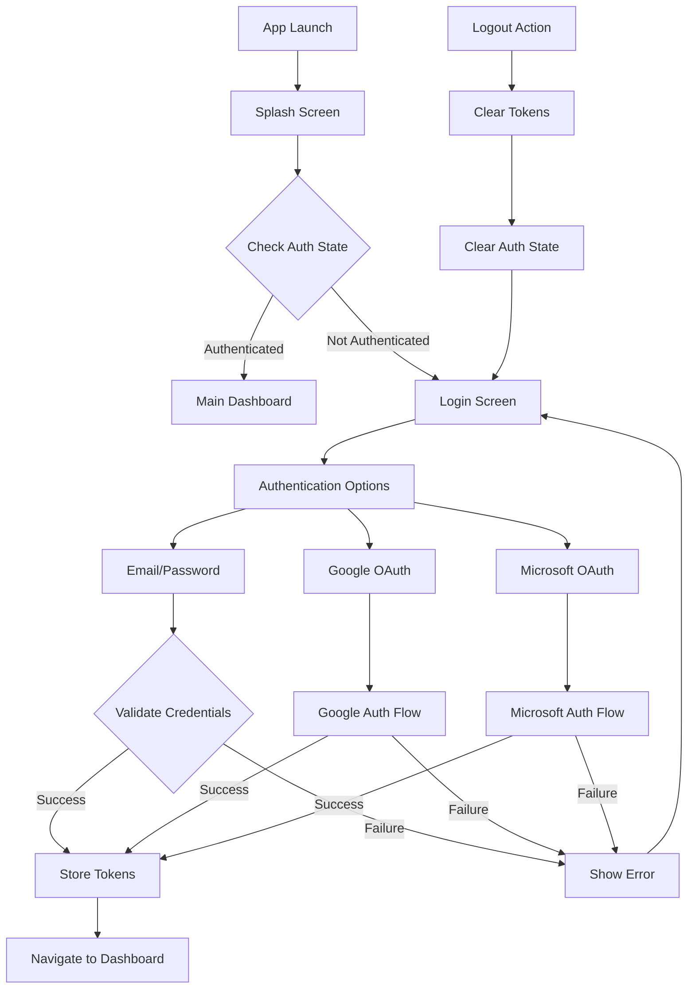
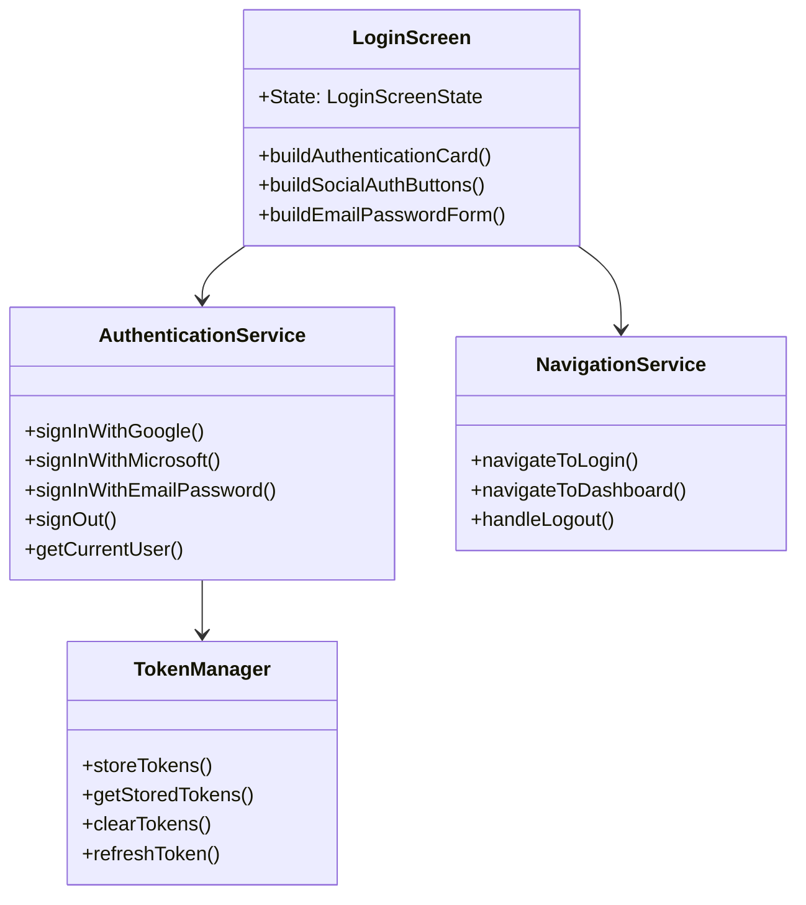
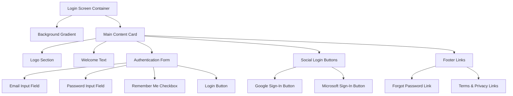
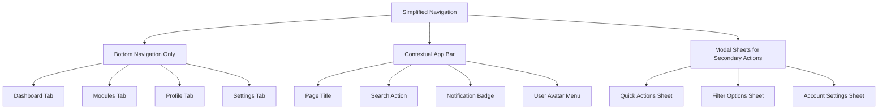
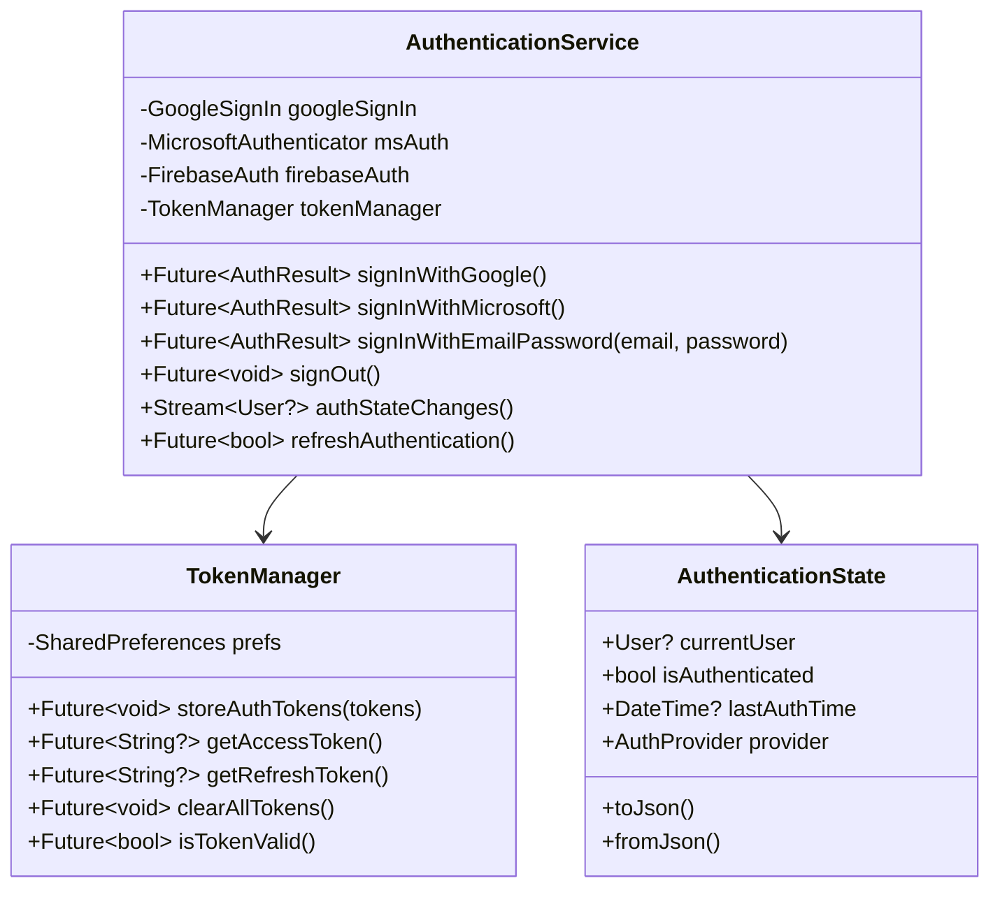
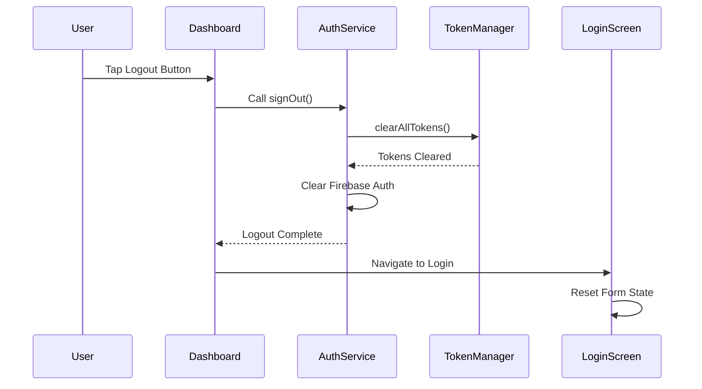

# Login Page Rework Design Document

## Overview

This design document outlines the comprehensive rework of the login page for the School Management App, including the integration of Google and Microsoft authentication methods, removal of registration functionality, logout-to-login flow implementation, and main layout redesign with simplified navigation structure.

## Technology Stack & Dependencies

### Authentication Dependencies
- **google_sign_in**: ^6.1.5 - Google OAuth integration
- **microsoft_graph_auth**: ^3.0.0 - Microsoft authentication 
- **firebase_auth**: ^4.15.0 - Authentication state management
- **shared_preferences**: ^2.2.2 - Token storage
- **crypto**: ^3.0.3 - Secure token handling

### UI Enhancement Dependencies  
- **flutter_svg**: ^2.0.7 - Social login icons
- **lottie**: ^2.7.0 - Loading animations
- **shimmer**: ^3.0.0 - Loading states

## Architecture

### Authentication Flow Architecture

### Login Screen Component Architecture

## Login Screen Redesign

### Layout Structure

### Visual Design Specifications

#### Color Scheme
- **Primary Background**: Linear gradient from `AppColors.primaryMint.withOpacity(0.05)` to `AppColors.white`
- **Card Background**: `AppColors.white` with elevation shadow
- **Primary Action**: `AppColors.primaryMint` 
- **Secondary Actions**: `AppColors.lightGray` with colored accents
- **Text Primary**: `AppColors.primaryNavy`
- **Text Secondary**: `AppColors.darkGray`

#### Typography
- **Welcome Title**: `AppTextStyles.h1` (28sp, Bold)
- **Subtitle**: `AppTextStyles.bodyLarge` (16sp, Regular)
- **Button Text**: `AppTextStyles.bodyMedium` (14sp, SemiBold)
- **Input Labels**: `AppTextStyles.bodySmall` (12sp, Medium)

#### Spacing & Layout
- **Container Padding**: 24px horizontal, 16px vertical
- **Card Margin**: 20px all sides
- **Element Spacing**: 16px standard, 24px section breaks
- **Button Height**: 56px minimum touch target
- **Input Field Height**: 48px with 12px padding

### Authentication Methods

#### Email/Password Authentication
- **Form Validation**: Real-time validation with visual feedback
- **Error Handling**: Inline error messages below inputs
- **Security**: Password visibility toggle, strength indicator
- **Remember Me**: Persistent login state storage

#### Google OAuth Integration
- **Sign-In Flow**: Native Google Sign-In SDK
- **Button Design**: Official Google brand guidelines
- **Scope Requests**: Profile, email access
- **Error Handling**: Network timeout, user cancellation

#### Microsoft OAuth Integration  
- **Authentication**: Microsoft Graph Authentication Library
- **Enterprise Support**: Azure AD and personal accounts
- **Button Design**: Microsoft brand guidelines compliance
- **Permissions**: User profile and email reading

## Main Layout Redesign

### Simplified Navigation Structure

#### Current Navigation Issues
- Multiple navigation patterns (sidebar + bottom nav)
- Redundant menu items across different screens
- Complex role-based navigation logic
- Inconsistent navigation behavior

#### Redesigned Navigation Strategy

### Dashboard Layout Optimization

#### Removed Components
- **Complex Sidebar Navigation**: Replaced with bottom navigation
- **Multiple Dashboard Variants**: Unified dashboard design
- **Excessive Quick Actions**: Streamlined to essential functions
- **Redundant Status Cards**: Consolidated into key metrics

#### Enhanced Components
- **Welcome Header**: Personalized greeting with user context
- **Key Metrics Cards**: Simplified 2x2 grid layout
- **Recent Activity Stream**: Chronological feed design
- **Quick Access Toolbar**: Contextual floating action button

### Responsive Design Improvements

#### Mobile-First Approach
- **Touch Targets**: Minimum 44px touch areas
- **Thumb Navigation**: Bottom-accessible primary actions
- **Content Hierarchy**: Clear visual emphasis on key information
- **Scrolling Behavior**: Smooth momentum scrolling with bounce

#### Tablet Adaptations
- **Split View Layout**: Side-by-side content panels
- **Extended Navigation**: Horizontal tab bar when space allows
- **Grid Scaling**: Dynamic column count based on screen width
- **Modal Presentations**: Popover style on larger screens

## Authentication Service Implementation

### Service Architecture

### Error Handling Strategy

#### Authentication Errors
- **Network Errors**: Retry mechanism with exponential backoff
- **Invalid Credentials**: Clear messaging with password reset option
- **OAuth Cancellation**: Graceful return to login screen
- **Token Expiration**: Automatic refresh with fallback to re-authentication

#### User Experience Considerations
- **Loading States**: Animated indicators during authentication
- **Progress Feedback**: Step-by-step OAuth flow indication
- **Error Recovery**: Clear action paths for error resolution
- **Accessibility**: Screen reader support for all authentication states

## Logout Flow Implementation

### Logout Process

### Session Management
- **Automatic Logout**: Session timeout after 24 hours of inactivity
- **Secure Cleanup**: Complete removal of authentication tokens
- **State Reset**: Clear all cached user data and preferences
- **Navigation Reset**: Return to login as root navigation state

## Security Considerations

### Token Storage Security
- **Encrypted Storage**: AES encryption for sensitive tokens
- **Keychain Integration**: Platform-specific secure storage
- **Token Rotation**: Automatic refresh token rotation
- **Biometric Protection**: Optional biometric authentication

### OAuth Security Best Practices
- **PKCE Implementation**: Proof Key for Code Exchange for OAuth flows
- **State Validation**: Anti-CSRF state parameter validation
- **Scope Limitation**: Minimal necessary permission requests
- **SSL Pinning**: Certificate pinning for authentication endpoints

## Testing Strategy

### Unit Testing Coverage
- **Authentication Service**: All sign-in methods and error cases
- **Token Manager**: Storage, retrieval, and cleanup operations
- **Form Validation**: Email and password validation logic
- **Navigation Logic**: Route transitions and state management

### Integration Testing
- **OAuth Flows**: End-to-end Google and Microsoft authentication
- **Session Management**: Login, logout, and token refresh cycles
- **Error Scenarios**: Network failures and authentication errors
- **Platform Testing**: iOS and Android specific authentication flows

### UI Testing
- **Form Interactions**: Input validation and submission
- **Button States**: Loading, disabled, and error states
- **Navigation Flows**: Login to dashboard transitions
- **Accessibility**: Screen reader and keyboard navigation