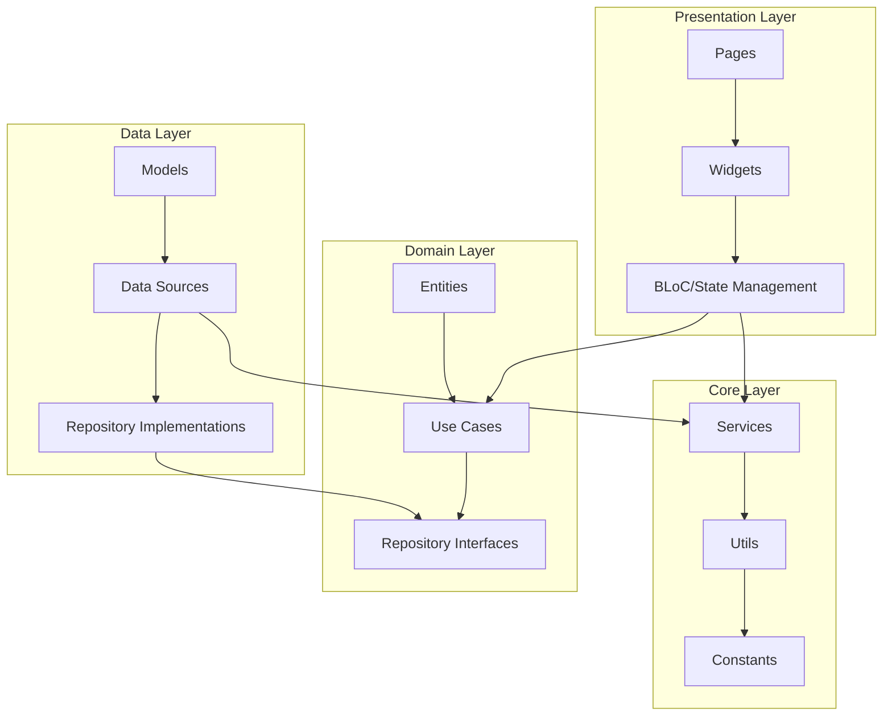
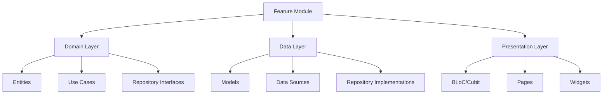
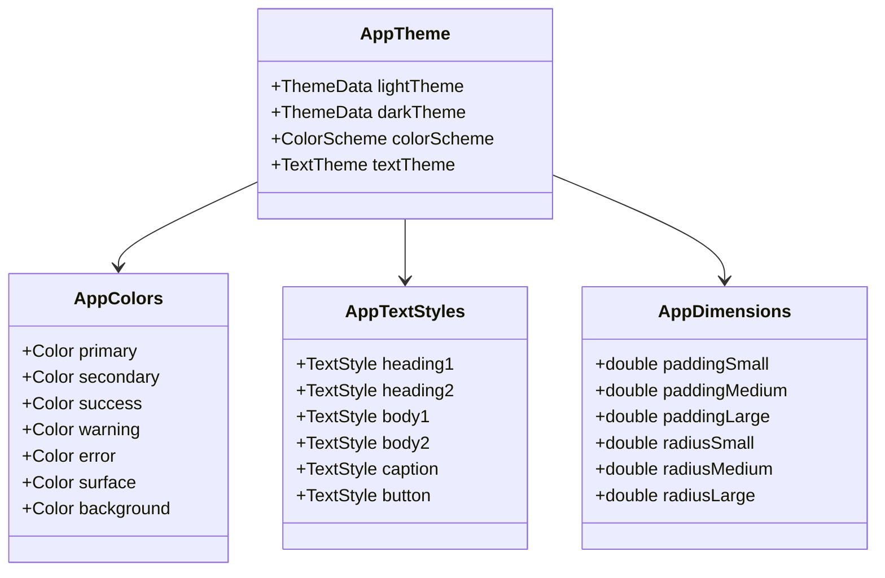
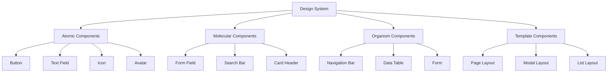
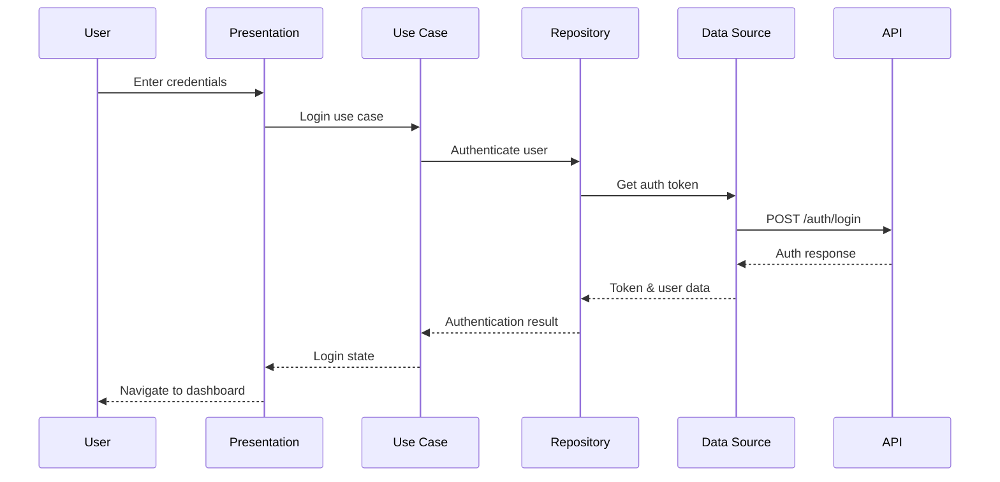

# Project Structure Refactoring for School ERP System

## Overview

This document outlines a comprehensive refactoring plan to transform the current school management app into a robust ERP system following modern software architecture best practices. The refactoring focuses on implementing Clean Architecture principles, establishing a unified design system, and creating modular components for scalability.

## Current State Analysis

### Current Structure Issues
- Limited module organization and inconsistent naming conventions
- Incomplete Clean Architecture implementation
- Missing domain and data layers
- Lack of comprehensive error handling and state management
- Insufficient design system documentation

### Target Architecture Goals
- Implement complete Clean Architecture with proper layer separation
- Establish comprehensive ERP module structure
- Create unified design system with consistent components
- Implement robust authentication and user management
- Build modular architecture for easy feature expansion

## Proposed Project Structure

### Directory Architecture

```
lib/
├── core/
│   ├── config/
│   │   ├── app_config.dart
│   │   ├── injection_container.dart
│   │   ├── routes.dart
│   │   └── environment.dart
│   ├── constants/
│   │   ├── api_constants.dart
│   │   ├── app_constants.dart
│   │   ├── storage_constants.dart
│   │   └── validation_constants.dart
│   ├── errors/
│   │   ├── exceptions.dart
│   │   ├── failures.dart
│   │   └── error_handler.dart
│   ├── network/
│   │   ├── api_client.dart
│   │   ├── interceptors/
│   │   │   ├── auth_interceptor.dart
│   │   │   ├── error_interceptor.dart
│   │   │   └── logger_interceptor.dart
│   │   └── network_info.dart
│   ├── services/
│   │   ├── cache_service.dart
│   │   ├── local_storage_service.dart
│   │   ├── notification_service.dart
│   │   └── permission_service.dart
│   ├── theme/
│   │   ├── app_theme.dart
│   │   ├── colors.dart
│   │   ├── text_styles.dart
│   │   ├── dimensions.dart
│   │   └── decorations.dart
│   └── utils/
│       ├── date_utils.dart
│       ├── validators.dart
│       ├── formatters.dart
│       ├── extensions/
│       │   ├── string_extensions.dart
│       │   ├── datetime_extensions.dart
│       │   └── context_extensions.dart
│       └── helpers/
│           ├── dialog_helper.dart
│           ├── snackbar_helper.dart
│           └── navigation_helper.dart
├── features/
│   ├── auth/
│   │   ├── domain/
│   │   │   ├── entities/
│   │   │   │   ├── user.dart
│   │   │   │   └── auth_token.dart
│   │   │   ├── repositories/
│   │   │   │   └── auth_repository.dart
│   │   │   └── usecases/
│   │   │       ├── login_usecase.dart
│   │   │       ├── logout_usecase.dart
│   │   │       ├── register_usecase.dart
│   │   │       └── refresh_token_usecase.dart
│   │   ├── data/
│   │   │   ├── datasources/
│   │   │   │   ├── auth_local_datasource.dart
│   │   │   │   └── auth_remote_datasource.dart
│   │   │   ├── models/
│   │   │   │   ├── user_model.dart
│   │   │   │   └── auth_token_model.dart
│   │   │   └── repositories/
│   │   │       └── auth_repository_impl.dart
│   │   └── presentation/
│   │       ├── bloc/
│   │       │   ├── auth_bloc.dart
│   │       │   ├── auth_event.dart
│   │       │   └── auth_state.dart
│   │       ├── pages/
│   │       │   ├── login_page.dart
│   │       │   ├── register_page.dart
│   │       │   └── forgot_password_page.dart
│   │       └── widgets/
│   │           ├── login_form.dart
│   │           ├── auth_button.dart
│   │           └── password_field.dart
│   ├── user_management/
│   │   ├── domain/
│   │   │   ├── entities/
│   │   │   │   ├── user_profile.dart
│   │   │   │   ├── role.dart
│   │   │   │   └── permission.dart
│   │   │   ├── repositories/
│   │   │   │   └── user_repository.dart
│   │   │   └── usecases/
│   │   │       ├── get_user_profile_usecase.dart
│   │   │       ├── update_user_profile_usecase.dart
│   │   │       └── manage_permissions_usecase.dart
│   │   ├── data/
│   │   │   ├── datasources/
│   │   │   ├── models/
│   │   │   └── repositories/
│   │   └── presentation/
│   │       ├── bloc/
│   │       ├── pages/
│   │       └── widgets/
│   ├── dashboard/
│   │   ├── domain/
│   │   ├── data/
│   │   └── presentation/
│   ├── academic/
│   │   ├── student_management/
│   │   ├── teacher_management/
│   │   ├── class_management/
│   │   ├── curriculum/
│   │   └── grades/
│   ├── finance/
│   │   ├── fee_management/
│   │   ├── payroll/
│   │   ├── budget/
│   │   └── reports/
│   ├── administration/
│   │   ├── announcements/
│   │   ├── events/
│   │   ├── facilities/
│   │   └── inventory/
│   └── communication/
│       ├── messaging/
│       ├── notifications/
│       └── parent_portal/
├── shared/
│   ├── widgets/
│   │   ├── common/
│   │   │   ├── app_button.dart
│   │   │   ├── app_text_field.dart
│   │   │   ├── app_card.dart
│   │   │   ├── app_loading.dart
│   │   │   ├── app_error.dart
│   │   │   └── app_empty_state.dart
│   │   ├── layout/
│   │   │   ├── responsive_layout.dart
│   │   │   ├── sidebar.dart
│   │   │   ├── app_bar.dart
│   │   │   └── bottom_navigation.dart
│   │   └── forms/
│   │       ├── form_field.dart
│   │       ├── date_picker.dart
│   │       ├── dropdown.dart
│   │       └── file_upload.dart
│   ├── models/
│   │   ├── api_response.dart
│   │   ├── pagination.dart
│   │   └── filter_model.dart
│   └── enums/
│       ├── user_role.dart
│       ├── permission_type.dart
│       └── module_type.dart
└── main.dart
```

## Clean Architecture Implementation

### Layer Definitions



### Feature Module Structure

Each feature module follows the same pattern:



## Design System Architecture

### Theme Structure



### Component Hierarchy



## Authentication & User Management Module

### Authentication Flow



### User Entity Structure

| Entity | Properties | Relationships |
|--------|------------|---------------|
| User | id, email, firstName, lastName, phone, status | Has many Roles |
| Role | id, name, description, permissions | Belongs to Users |
| Permission | id, name, module, action | Belongs to Roles |
| UserProfile | userId, avatar, bio, preferences | Belongs to User |

### Authentication Components

| Component | Purpose | Props |
|-----------|---------|-------|
| LoginForm | User authentication form | onSubmit, isLoading |
| AuthButton | Styled login/logout button | text, onPressed, variant |
| PasswordField | Secure password input | onChanged, validator |
| ForgotPasswordDialog | Password reset modal | onSubmit |

## Module Development Guidelines

### Creating a New Module

#### Step 1: Module Structure Setup
```
features/new_module/
├── domain/
│   ├── entities/
│   ├── repositories/
│   └── usecases/
├── data/
│   ├── datasources/
│   ├── models/
│   └── repositories/
└── presentation/
    ├── bloc/
    ├── pages/
    └── widgets/
```

#### Step 2: Domain Layer Implementation
1. **Define Entities**: Pure Dart classes representing business objects
2. **Create Repository Interfaces**: Abstract contracts for data operations
3. **Implement Use Cases**: Business logic encapsulation

#### Step 3: Data Layer Implementation
1. **Create Models**: JSON serializable data classes
2. **Implement Data Sources**: API and local storage interfaces
3. **Implement Repositories**: Concrete repository implementations

#### Step 4: Presentation Layer Implementation
1. **Create BLoC/Cubit**: State management for the module
2. **Build Pages**: Main screens for the module
3. **Create Widgets**: Reusable UI components

#### Step 5: Integration
1. **Register Dependencies**: Add to injection container
2. **Add Routes**: Register navigation routes
3. **Update Navigation**: Add to sidebar/bottom navigation

### Module Template

```dart
// Domain Entity Template
class ModuleEntity {
  final String id;
  final String name;
  final DateTime createdAt;
  final DateTime updatedAt;
  
  const ModuleEntity({
    required this.id,
    required this.name,
    required this.createdAt,
    required this.updatedAt,
  });
}

// Repository Interface Template
abstract class ModuleRepository {
  Future<Either<Failure, List<ModuleEntity>>> getModules();
  Future<Either<Failure, ModuleEntity>> getModuleById(String id);
  Future<Either<Failure, ModuleEntity>> createModule(ModuleEntity module);
  Future<Either<Failure, ModuleEntity>> updateModule(ModuleEntity module);
  Future<Either<Failure, bool>> deleteModule(String id);
}

// Use Case Template
class GetModulesUseCase {
  final ModuleRepository repository;
  
  GetModulesUseCase(this.repository);
  
  Future<Either<Failure, List<ModuleEntity>>> call() async {
    return await repository.getModules();
  }
}
```

## Common Components Library

### Form Components

| Component | Description | Usage |
|-----------|-------------|--------|
| AppTextField | Styled text input field | Text input, email, phone |
| AppDropdown | Dropdown selection | Single/multi-select options |
| AppDatePicker | Date selection | Date/time selection |
| AppFileUpload | File upload component | Document/image upload |
| AppFormField | Generic form field wrapper | Form validation wrapper |

### Layout Components

| Component | Description | Responsive Behavior |
|-----------|-------------|-------------------|
| ResponsiveLayout | Adaptive layout container | Sidebar on desktop, bottom nav on mobile |
| AppScaffold | Standardized page structure | Consistent header, body, footer |
| DataTable | Responsive data display | Horizontal scroll on mobile |
| GridLayout | Responsive grid system | Column count based on screen size |

### Feedback Components

| Component | Description | States |
|-----------|-------------|--------|
| AppButton | Styled button component | Default, loading, disabled |
| AppLoadingIndicator | Loading state display | Linear, circular, skeleton |
| AppErrorWidget | Error state display | Network, validation, generic |
| AppEmptyState | Empty data display | No data, no results, no access |

## Design System Documentation

### Color System

```dart
class AppColors {
  // Primary Colors
  static const Color primary = Color(0xFF1976D2);
  static const Color primaryLight = Color(0xFF42A5F5);
  static const Color primaryDark = Color(0xFF1565C0);
  
  // Secondary Colors
  static const Color secondary = Color(0xFF03DAC6);
  static const Color secondaryLight = Color(0xFF4EDFE7);
  static const Color secondaryDark = Color(0xFF00B894);
  
  // Semantic Colors
  static const Color success = Color(0xFF4CAF50);
  static const Color warning = Color(0xFFFF9800);
  static const Color error = Color(0xFFF44336);
  static const Color info = Color(0xFF2196F3);
  
  // Neutral Colors
  static const Color white = Color(0xFFFFFFFF);
  static const Color black = Color(0xFF000000);
  static const Color grey50 = Color(0xFFFAFAFA);
  static const Color grey100 = Color(0xFFF5F5F5);
  static const Color grey200 = Color(0xFFEEEEEE);
  static const Color grey300 = Color(0xFFE0E0E0);
  static const Color grey400 = Color(0xFFBDBDBD);
  static const Color grey500 = Color(0xFF9E9E9E);
  static const Color grey600 = Color(0xFF757575);
  static const Color grey700 = Color(0xFF616161);
  static const Color grey800 = Color(0xFF424242);
  static const Color grey900 = Color(0xFF212121);
}
```

### Typography Scale

```dart
class AppTextStyles {
  // Headings
  static const TextStyle h1 = TextStyle(
    fontSize: 32,
    fontWeight: FontWeight.bold,
    height: 1.25,
  );
  
  static const TextStyle h2 = TextStyle(
    fontSize: 28,
    fontWeight: FontWeight.w600,
    height: 1.25,
  );
  
  static const TextStyle h3 = TextStyle(
    fontSize: 24,
    fontWeight: FontWeight.w600,
    height: 1.3,
  );
  
  static const TextStyle h4 = TextStyle(
    fontSize: 20,
    fontWeight: FontWeight.w500,
    height: 1.3,
  );
  
  // Body Text
  static const TextStyle bodyLarge = TextStyle(
    fontSize: 16,
    fontWeight: FontWeight.normal,
    height: 1.5,
  );
  
  static const TextStyle bodyMedium = TextStyle(
    fontSize: 14,
    fontWeight: FontWeight.normal,
    height: 1.5,
  );
  
  static const TextStyle bodySmall = TextStyle(
    fontSize: 12,
    fontWeight: FontWeight.normal,
    height: 1.4,
  );
  
  // Special Styles
  static const TextStyle button = TextStyle(
    fontSize: 14,
    fontWeight: FontWeight.w500,
    height: 1.2,
  );
  
  static const TextStyle caption = TextStyle(
    fontSize: 12,
    fontWeight: FontWeight.normal,
    height: 1.3,
  );
}
```

### Spacing System

```dart
class AppSpacing {
  // Base unit: 4px
  static const double unit = 4.0;
  
  // Spacing Scale
  static const double xs = unit; // 4px
  static const double sm = unit * 2; // 8px
  static const double md = unit * 3; // 12px
  static const double lg = unit * 4; // 16px
  static const double xl = unit * 5; // 20px
  static const double xxl = unit * 6; // 24px
  static const double xxxl = unit * 8; // 32px
  
  // Semantic Spacing
  static const double paddingTiny = xs;
  static const double paddingSmall = sm;
  static const double paddingMedium = lg;
  static const double paddingLarge = xxl;
  static const double paddingExtraLarge = xxxl;
  
  static const double marginTiny = xs;
  static const double marginSmall = sm;
  static const double marginMedium = lg;
  static const double marginLarge = xxl;
  static const double marginExtraLarge = xxxl;
}
```

### Component Guidelines

#### Button Component Standards

```dart
class AppButton extends StatelessWidget {
  final String text;
  final VoidCallback? onPressed;
  final ButtonVariant variant;
  final ButtonSize size;
  final bool isLoading;
  final Widget? icon;
  
  const AppButton({
    Key? key,
    required this.text,
    this.onPressed,
    this.variant = ButtonVariant.primary,
    this.size = ButtonSize.medium,
    this.isLoading = false,
    this.icon,
  }) : super(key: key);
}

enum ButtonVariant {
  primary,
  secondary,
  outline,
  text,
  danger,
}

enum ButtonSize {
  small,
  medium,
  large,
}
```

#### Usage Examples

```dart
// Primary Button
AppButton(
  text: 'Save Changes',
  onPressed: () => _saveData(),
  variant: ButtonVariant.primary,
)

// Loading Button
AppButton(
  text: 'Submit',
  onPressed: null,
  isLoading: true,
)

// Button with Icon
AppButton(
  text: 'Add User',
  icon: Icon(Icons.add),
  onPressed: () => _addUser(),
)
```

### Responsive Breakpoints

```dart
class AppBreakpoints {
  static const double mobile = 576;
  static const double tablet = 768;
  static const double desktop = 992;
  static const double largeDesktop = 1200;
  
  static bool isMobile(BuildContext context) {
    return MediaQuery.of(context).size.width < tablet;
  }
  
  static bool isTablet(BuildContext context) {
    final width = MediaQuery.of(context).size.width;
    return width >= tablet && width < desktop;
  }
  
  static bool isDesktop(BuildContext context) {
    return MediaQuery.of(context).size.width >= desktop;
  }
}
```

## Implementation Roadmap

### Phase 1: Core Infrastructure (Weeks 1-2)
- [ ] Set up new project structure
- [ ] Implement Clean Architecture layers
- [ ] Create dependency injection system
- [ ] Establish error handling framework
- [ ] Set up routing and navigation

### Phase 2: Design System (Weeks 3-4)
- [ ] Create comprehensive theme system
- [ ] Build atomic components library
- [ ] Implement responsive layout system
- [ ] Create component documentation
- [ ] Set up design tokens

### Phase 3: Authentication Module (Week 5)
- [ ] Implement complete auth domain layer
- [ ] Build auth data layer with API integration
- [ ] Create auth presentation layer with BLoC
- [ ] Design login/register UI components
- [ ] Implement secure token management

### Phase 4: User Management Module (Week 6)
- [ ] Create user entities and use cases
- [ ] Implement user data layer
- [ ] Build user profile management UI
- [ ] Implement role and permission system
- [ ] Create user management dashboard

### Phase 5: Module Integration (Weeks 7-8)
- [ ] Integrate auth and user modules
- [ ] Implement main dashboard with role-based access
- [ ] Create module templates and guidelines
- [ ] Set up module registration system
- [ ] Test complete authentication flow

### Phase 6: Documentation & Testing (Week 9-10)
- [ ] Complete design system documentation
- [ ] Write module development guidelines
- [ ] Create component usage examples
- [ ] Implement unit and integration tests
- [ ] Performance optimization and validation

## Migration Strategy

### Gradual Migration Approach

1. **Parallel Development**: Build new structure alongside existing code
2. **Feature-by-Feature Migration**: Move features one at a time
3. **Component Replacement**: Replace old components with new design system
4. **Testing and Validation**: Ensure functionality parity
5. **Final Cleanup**: Remove deprecated code and files│   │   └── presentation/
│   ├── academic/
│   │   ├── student_management/
│   │   ├── teacher_management/
│   │   ├── class_management/
│   │   ├── curriculum/
│   │   └── grades/
│   ├── finance/
│   │   ├── fee_management/
│   │   ├── payroll/
│   │   ├── budget/
│   │   └── reports/
│   ├── administration/
│   │   ├── announcements/
│   │   ├── events/
│   │   ├── facilities/
│   │   └── inventory/
│   └── communication/
│       ├── messaging/
│       ├── notifications/
│       └── parent_portal/
├── shared/
│   ├── widgets/
│   │   ├── common/
│   │   │   ├── app_button.dart
│   │   │   ├── app_text_field.dart
│   │   │   ├── app_card.dart
│   │   │   ├── app_loading.dart
│   │   │   ├── app_error.dart
│   │   │   └── app_empty_state.dart
│   │   ├── layout/
│   │   │   ├── responsive_layout.dart
│   │   │   ├── sidebar.dart
│   │   │   ├── app_bar.dart
│   │   │   └── bottom_navigation.dart
│   │   └── forms/
│   │       ├── form_field.dart
│   │       ├── date_picker.dart
│   │       ├── dropdown.dart
│   │       └── file_upload.dart
│   ├── models/
│   │   ├── api_response.dart
│   │   ├── pagination.dart
│   │   └── filter_model.dart
│   └── enums/
│       ├── user_role.dart
│       ├── permission_type.dart
│       └── module_type.dart
└── main.dart
```

## Clean Architecture Implementation

### Layer Definitions


### Feature Module Structure

Each feature module follows the same pattern:


## Design System Architecture

### Theme Structure


### Component Hierarchy


## Authentication & User Management Module

### Authentication Flow


### User Entity Structure

| Entity | Properties | Relationships |
|--------|------------|---------------|
| User | id, email, firstName, lastName, phone, status | Has many Roles |
| Role | id, name, description, permissions | Belongs to Users |
| Permission | id, name, module, action | Belongs to Roles |
| UserProfile | userId, avatar, bio, preferences | Belongs to User |

### Authentication Components

| Component | Purpose | Props |
|-----------|---------|-------|
| LoginForm | User authentication form | onSubmit, isLoading |
| AuthButton | Styled login/logout button | text, onPressed, variant |
| PasswordField | Secure password input | onChanged, validator |
| ForgotPasswordDialog | Password reset modal | onSubmit |

## Module Development Guidelines

### Creating a New Module

#### Step 1: Module Structure Setup
```
features/new_module/
├── domain/
│   ├── entities/
│   ├── repositories/
│   └── usecases/
├── data/
│   ├── datasources/
│   ├── models/
│   └── repositories/
└── presentation/
    ├── bloc/
    ├── pages/
    └── widgets/
```

#### Step 2: Domain Layer Implementation
1. **Define Entities**: Pure Dart classes representing business objects
2. **Create Repository Interfaces**: Abstract contracts for data operations
3. **Implement Use Cases**: Business logic encapsulation

#### Step 3: Data Layer Implementation
1. **Create Models**: JSON serializable data classes
2. **Implement Data Sources**: API and local storage interfaces
3. **Implement Repositories**: Concrete repository implementations

#### Step 4: Presentation Layer Implementation
1. **Create BLoC/Cubit**: State management for the module
2. **Build Pages**: Main screens for the module
3. **Create Widgets**: Reusable UI components

#### Step 5: Integration
1. **Register Dependencies**: Add to injection container
2. **Add Routes**: Register navigation routes
3. **Update Navigation**: Add to sidebar/bottom navigation

### Module Template

```dart
// Domain Entity Template
class ModuleEntity {
  final String id;
  final String name;
  final DateTime createdAt;
  final DateTime updatedAt;
  
  const ModuleEntity({
    required this.id,
    required this.name,
    required this.createdAt,
    required this.updatedAt,
  });
}

// Repository Interface Template
abstract class ModuleRepository {
  Future<Either<Failure, List<ModuleEntity>>> getModules();
  Future<Either<Failure, ModuleEntity>> getModuleById(String id);
  Future<Either<Failure, ModuleEntity>> createModule(ModuleEntity module);
  Future<Either<Failure, ModuleEntity>> updateModule(ModuleEntity module);
  Future<Either<Failure, bool>> deleteModule(String id);
}

// Use Case Template
class GetModulesUseCase {
  final ModuleRepository repository;
  
  GetModulesUseCase(this.repository);
  
  Future<Either<Failure, List<ModuleEntity>>> call() async {
    return await repository.getModules();
  }
}
```

## Common Components Library

### Form Components

| Component | Description | Usage |
|-----------|-------------|--------|
| AppTextField | Styled text input field | Text input, email, phone |
| AppDropdown | Dropdown selection | Single/multi-select options |
| AppDatePicker | Date selection | Date/time selection |
| AppFileUpload | File upload component | Document/image upload |
| AppFormField | Generic form field wrapper | Form validation wrapper |

### Layout Components

| Component | Description | Responsive Behavior |
|-----------|-------------|-------------------|
| ResponsiveLayout | Adaptive layout container | Sidebar on desktop, bottom nav on mobile |
| AppScaffold | Standardized page structure | Consistent header, body, footer |
| DataTable | Responsive data display | Horizontal scroll on mobile |
| GridLayout | Responsive grid system | Column count based on screen size |

### Feedback Components

| Component | Description | States |
|-----------|-------------|--------|
| AppButton | Styled button component | Default, loading, disabled |
| AppLoadingIndicator | Loading state display | Linear, circular, skeleton |
| AppErrorWidget | Error state display | Network, validation, generic |
| AppEmptyState | Empty data display | No data, no results, no access |

## Design System Documentation

### Color System

```dart
class AppColors {
  // Primary Colors
  static const Color primary = Color(0xFF1976D2);
  static const Color primaryLight = Color(0xFF42A5F5);
  static const Color primaryDark = Color(0xFF1565C0);
  
  // Secondary Colors
  static const Color secondary = Color(0xFF03DAC6);
  static const Color secondaryLight = Color(0xFF4EDFE7);
  static const Color secondaryDark = Color(0xFF00B894);
  
  // Semantic Colors
  static const Color success = Color(0xFF4CAF50);
  static const Color warning = Color(0xFFFF9800);
  static const Color error = Color(0xFFF44336);
  static const Color info = Color(0xFF2196F3);
  
  // Neutral Colors
  static const Color white = Color(0xFFFFFFFF);
  static const Color black = Color(0xFF000000);
  static const Color grey50 = Color(0xFFFAFAFA);
  static const Color grey100 = Color(0xFFF5F5F5);
  static const Color grey200 = Color(0xFFEEEEEE);
  static const Color grey300 = Color(0xFFE0E0E0);
  static const Color grey400 = Color(0xFFBDBDBD);
  static const Color grey500 = Color(0xFF9E9E9E);
  static const Color grey600 = Color(0xFF757575);
  static const Color grey700 = Color(0xFF616161);
  static const Color grey800 = Color(0xFF424242);
  static const Color grey900 = Color(0xFF212121);
}
```

### Typography Scale

```dart
class AppTextStyles {
  // Headings
  static const TextStyle h1 = TextStyle(
    fontSize: 32,
    fontWeight: FontWeight.bold,
    height: 1.25,
  );
  
  static const TextStyle h2 = TextStyle(
    fontSize: 28,
    fontWeight: FontWeight.w600,
    height: 1.25,
  );
  
  static const TextStyle h3 = TextStyle(
    fontSize: 24,
    fontWeight: FontWeight.w600,
    height: 1.3,
  );
  
  static const TextStyle h4 = TextStyle(
    fontSize: 20,
    fontWeight: FontWeight.w500,
    height: 1.3,
  );
  
  // Body Text
  static const TextStyle bodyLarge = TextStyle(
    fontSize: 16,
    fontWeight: FontWeight.normal,
    height: 1.5,
  );
  
  static const TextStyle bodyMedium = TextStyle(
    fontSize: 14,
    fontWeight: FontWeight.normal,
    height: 1.5,
  );
  
  static const TextStyle bodySmall = TextStyle(
    fontSize: 12,
    fontWeight: FontWeight.normal,
    height: 1.4,
  );
  
  // Special Styles
  static const TextStyle button = TextStyle(
    fontSize: 14,
    fontWeight: FontWeight.w500,
    height: 1.2,
  );
  
  static const TextStyle caption = TextStyle(
    fontSize: 12,
    fontWeight: FontWeight.normal,
    height: 1.3,
  );
}
```

### Spacing System

```dart
class AppSpacing {
  // Base unit: 4px
  static const double unit = 4.0;
  
  // Spacing Scale
  static const double xs = unit; // 4px
  static const double sm = unit * 2; // 8px
  static const double md = unit * 3; // 12px
  static const double lg = unit * 4; // 16px
  static const double xl = unit * 5; // 20px
  static const double xxl = unit * 6; // 24px
  static const double xxxl = unit * 8; // 32px
  
  // Semantic Spacing
  static const double paddingTiny = xs;
  static const double paddingSmall = sm;
  static const double paddingMedium = lg;
  static const double paddingLarge = xxl;
  static const double paddingExtraLarge = xxxl;
  
  static const double marginTiny = xs;
  static const double marginSmall = sm;
  static const double marginMedium = lg;
  static const double marginLarge = xxl;
  static const double marginExtraLarge = xxxl;
}
```

### Component Guidelines

#### Button Component Standards

```dart
class AppButton extends StatelessWidget {
  final String text;
  final VoidCallback? onPressed;
  final ButtonVariant variant;
  final ButtonSize size;
  final bool isLoading;
  final Widget? icon;
  
  const AppButton({
    Key? key,
    required this.text,
    this.onPressed,
    this.variant = ButtonVariant.primary,
    this.size = ButtonSize.medium,
    this.isLoading = false,
    this.icon,
  }) : super(key: key);
}

enum ButtonVariant {
  primary,
  secondary,
  outline,
  text,
  danger,
}

enum ButtonSize {
  small,
  medium,
  large,
}
```

#### Usage Examples

```dart
// Primary Button
AppButton(
  text: 'Save Changes',
  onPressed: () => _saveData(),
  variant: ButtonVariant.primary,
)

// Loading Button
AppButton(
  text: 'Submit',
  onPressed: null,
  isLoading: true,
)

// Button with Icon
AppButton(
  text: 'Add User',
  icon: Icon(Icons.add),
  onPressed: () => _addUser(),
)
```

### Responsive Breakpoints

```dart
class AppBreakpoints {
  static const double mobile = 576;
  static const double tablet = 768;
  static const double desktop = 992;
  static const double largeDesktop = 1200;
  
  static bool isMobile(BuildContext context) {
    return MediaQuery.of(context).size.width < tablet;
  }
  
  static bool isTablet(BuildContext context) {
    final width = MediaQuery.of(context).size.width;
    return width >= tablet && width < desktop;
  }
  
  static bool isDesktop(BuildContext context) {
    return MediaQuery.of(context).size.width >= desktop;
  }
}
```

## Implementation Roadmap

### Phase 1: Core Infrastructure (Weeks 1-2)
- [ ] Set up new project structure
- [ ] Implement Clean Architecture layers
- [ ] Create dependency injection system
- [ ] Establish error handling framework
- [ ] Set up routing and navigation

### Phase 2: Design System (Weeks 3-4)
- [ ] Create comprehensive theme system
- [ ] Build atomic components library
- [ ] Implement responsive layout system
- [ ] Create component documentation
- [ ] Set up design tokens

### Phase 3: Authentication Module (Week 5)
- [ ] Implement complete auth domain layer
- [ ] Build auth data layer with API integration
- [ ] Create auth presentation layer with BLoC
- [ ] Design login/register UI components
- [ ] Implement secure token management

### Phase 4: User Management Module (Week 6)
- [ ] Create user entities and use cases
- [ ] Implement user data layer
- [ ] Build user profile management UI
- [ ] Implement role and permission system
- [ ] Create user management dashboard

### Phase 5: Module Integration (Weeks 7-8)
- [ ] Integrate auth and user modules
- [ ] Implement main dashboard with role-based access
- [ ] Create module templates and guidelines
- [ ] Set up module registration system
- [ ] Test complete authentication flow

### Phase 6: Documentation & Testing (Week 9-10)
- [ ] Complete design system documentation
- [ ] Write module development guidelines
- [ ] Create component usage examples
- [ ] Implement unit and integration tests
- [ ] Performance optimization and validation

## Migration Strategy

### Gradual Migration Approach

1. **Parallel Development**: Build new structure alongside existing code
2. **Feature-by-Feature Migration**: Move features one at a time
3. **Component Replacement**: Replace old components with new design system
4. **Testing and Validation**: Ensure functionality parity
5. **Final Cleanup**: Remove deprecated code and files


